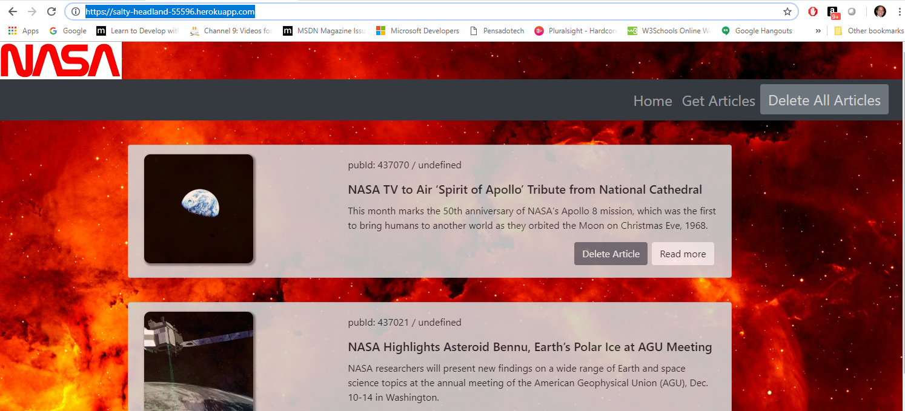
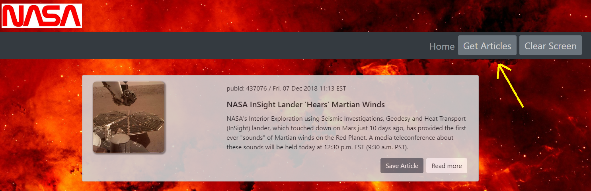
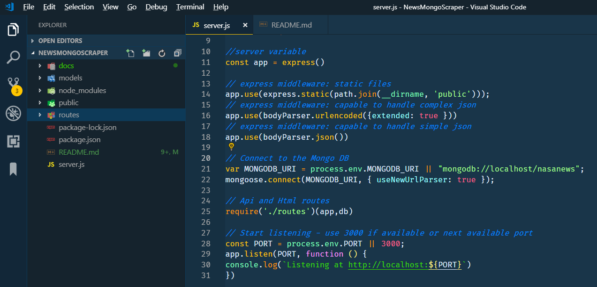

# NewsMongoScraper
News Mongo Scraper Exercise

_by Armando Pensado_ 

## Description

The application is an exercise retrieving data from a Website (html file) using a scraping library. In this case the example uses **axios**, **cheerio**.  The application uses **express** and it is storing the data in a MongoDB using **mongoose**. 
The application search for information at NASA breaking news RSS (https://www.nasa.gov/rss/dyn/breaking_news.rss) and presents the articles to the user, giving the capability to store in the database articles that are interesting.




A running version of the applicaiton can be found at:

https://salty-headland-55596.herokuapp.com/


## How does it works

The application operation is very simple, as it offers two html pages. The main page will read from the database any articles stored and show them to the user. The user will have the functionality to remove one article that may not be need anymore, and the capability to delete all articles.

The second page is designed to help the user access the NADA breaking news RSS and present the article sin the screen. The user can do this by selecting the button in the menu “Get Articles”. Each article will offer the option to be stored into the database, or a link to read the more details on the news.

The second page is going through an express route that uses “axios” and “cheerio” libraries to do the work.



## Who can benefit from this application

This application is beneficial for NodeJS developer, providing sample programming structures using JavaScript, and using **Express**, **MySql**, **seqelize (ORM)**, and API routes that encapsulate the logic to access the database.

## How developers can get started

To start, the developer must have NodeJS installed in the computer. After, that the project can be cloned and initialized.  Here are the steps for getting started.

1. Install NodeJS into the computer  (https://nodejs.org/en/). Download button and run through the installation file.

2. Clone or Fork the project into the computer.

3. Bring all external module dependencies using the command:

```js
npm i
```

After, the initialization, and using Microsoft Visual Code, the project folder should resemble as depicted below, and should be ready for execution.



once the application is setup, launch the server, using one of the two following commands. That last one is in case the NODEMON nmp was installed (_npm install -g nodemon_).

```js

node server.js

or

nodemon

```


## Who maintains and contributes to the project

This is a project for my personal learning process.

## Where users can get help with the project

The developer can refer to the following links:

* NodeJs   : https://nodejs.org/en/
* Express  : https://www.npmjs.com/package/express
* mongoDB  : https://www.mongodb.com/
* mongoose : https://mongoosejs.com/
* axios    : https://www.npmjs.com/package/axios
* cheerio  : https://www.npmjs.com/package/cheerio

